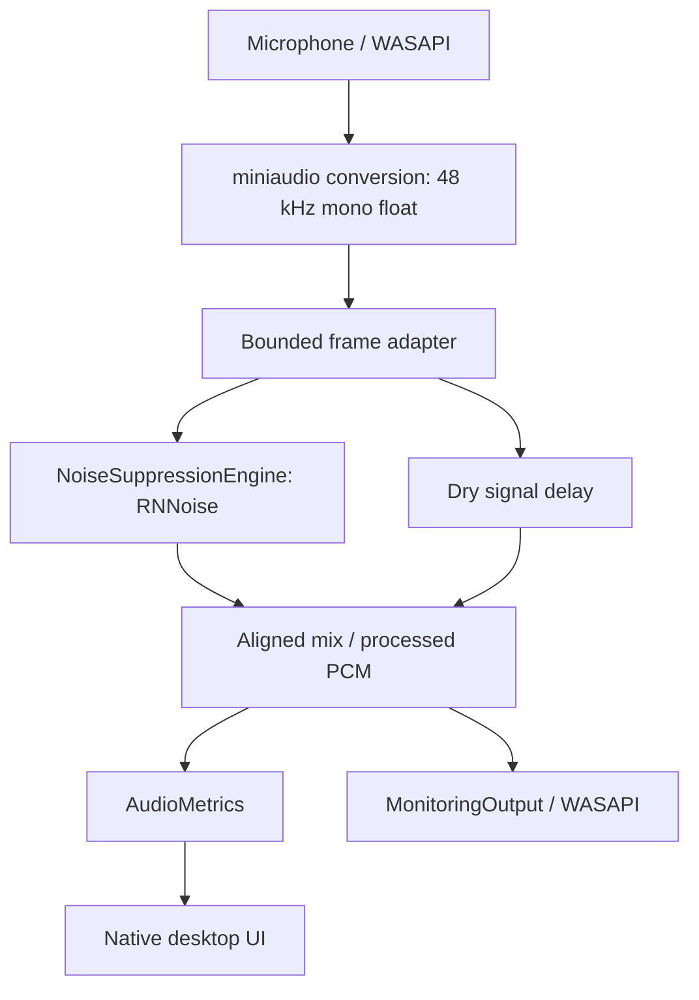

# Architecture

## Data path

## Responsibilities

| Abstraction | Location | Contract |
|---|---|---|
| AudioInput | `include/luna/audio.hpp` | Enumerate endpoints, start a callback, report running state, stop and release capture. |
| MiniaudioInput | `src/audio.cpp` | Own context and duplex device; Windows explicitly selects WASAPI. Capture/playback format negotiation, resampling and channel conversion are delegated to miniaudio/OS. |
| NoiseSuppressionEngine | `include/luna/engine.hpp` | Normalized float mono input/output; declared sample rate, frame size and algorithmic latency; no allocation or exceptions during `process`. |
| RNNoiseEngine | `src/engine.cpp` | Own RNNoise state, convert normalized PCM to/from 16-bit-amplitude float units, call upstream inference. |
| AudioProcessor | `src/processor.cpp` | Arbitrary capture chunk sizes to exact engine frames, delay-aligned bypass/mixing, smooth control transitions. |
| AudioOutput / MonitoringOutput | `src/audio.cpp` | Render processed PCM into the selected playback buffer with mute, -12 dB headphone mode, or unity gain virtual-cable mode and a short gain ramp. The virtual recording endpoint belongs to a separately installed driver. |
| AudioMetrics | `include/luna/metrics.hpp` | Lock-free scalar snapshots; frame RMS/peak, elapsed DSP/callback timing, overruns, invalid sample count. |
| Application UI | `src/windows_ui.cpp` | Device selection, explicit Start/Stop, on/off, mix, monitoring and 10 Hz metrics rendering. No audio work on paint callbacks. |
| WAV test adapter | `src/wav.cpp` | Local RIFF validation/decoding, 48 kHz mono conversion, exclusive creation of PCM16 output, delay trimming and tail flush. |

## Threading and lifecycle

The UI owns a LiveSession. Device enumeration/start/stop occur on its control
thread. Starting creates a fresh AudioProcessor before opening/starting WASAPI.
The duplex audio callback performs bounded PCM work and uses no application
allocation, file I/O, logging, locks or UI calls. miniaudio owns backend threads,
its conversion buffers and duplex synchronization. Its backend internals may use
their own synchronization; this is not a hard real-time OS guarantee.

RNNoise v0.1 has lazily initialized shared FFT tables. `makeRNNoise()` serializes
the first warm-up with `std::call_once` on the caller/control thread, before any
audio callback runs. Each session has a separate recurrent state. Upstream code
and model are unchanged.

Controls are lock-free atomics. V1 targets x64 and checks metric atomics at compile
time. Only the audio thread writes processing history. UI metric fields are
individually atomic and may describe adjacent frames; they are an approximate
display snapshot, not a transactionally consistent packet.

Stopping uninitializes/joins the device before processor destruction or replacement.
Device interruption notifications only increment atomic counters. UI polling detects
unexpected stops; the user stops, refreshes and restarts. No automatic retry loop
silently changes the selected microphone. Errors opening endpoints are surfaced.

## Buffering, normalization and latency

The interface sample rate is always 48,000 Hz, mono float PCM. Device-native rates,
formats and channel counts may differ. A requested 480-sample backend period is a
hint. miniaudio negotiates/converts to the application's interface format. The UI
reports both native endpoint rates/channel counts and the application format.

The application adapter owns fixed-size vectors allocated before streaming.
For the current engine, one 480-sample input frame and one output frame implement
a constant 10 ms adapter delay across arbitrary callback partitions. RNNoise's
window/overlap adds another 480 samples. The dry path is delayed by the engine's
declared latency before mixing, preserving gross time alignment when toggling.
RNNoise's filtering may still alter phase and timbre; a dry/wet mix is not a
calibrated amount of noise attenuation.

Both enabled and bypass modes keep the 960-sample (20 ms) pipeline delay. A control
change ramps across one engine frame and keeps RNNoise state warm. Output PCM is
bounded to [-1,1]. Non-finite capture samples become zero and are counted. No
unbounded application audio queues grow over time.

DSP timing uses `steady_clock` around inference and mixing. Callback timing includes
framing, metrics and monitoring work. Time spent collecting a frame, device/driver
buffers, resampling group delay, OS scheduling and DAC/ADC latency are not included
in the DSP number. Physical latency must be measured externally; no estimated
hardware total is represented as a measurement. Late callback/frame counters do
not detect every possible backend starvation event.

## WAV processing and bounded memory

The same AudioProcessor runs in WAV and live modes. The decoder converts input to
48 kHz mono. Blocks are at most 4096 samples; file duration does not increase RAM
use. The writer discards the first `latencySamples()` output samples, flushes the
same number of zeros at EOF, and preserves the decoded/resampled sample count.
Short files and final partial frames are included in tests. Output WAV headers are
finalized only on success; partial output is removed on handled failures. A forced
process termination can still leave an incomplete test-output file.

The writer uses exclusive file creation, so existing outputs, originals and symlink
targets cannot be truncated. RIFF bounds are checked before decoding. Input is never
modified. The writer has a standard RIFF size bound and produces mono PCM16.

## Replacing or comparing engines

Implement NoiseSuppressionEngine and inject it into AudioProcessor. The interface
supports a different bounded frame size and latency, including non-frame-multiple
delay. Tests exercise this using a 37-sample frame / 53-sample delay stub. A
DeepFilterNet adapter must expose 48 kHz normalized mono PCM, report its true delay,
allocate model state before streaming and fit the callback time budget. If it
cannot meet that contract, add a bounded worker queue with explicit latency and
dropout telemetry rather than blocking the callback.

Compare engines on the same authorized clips, sample rates, gain and time alignment.
Use separate engine instances; retain raw metrics and listening-test results.
DeepFilterNet is not linked or downloaded by V1.
